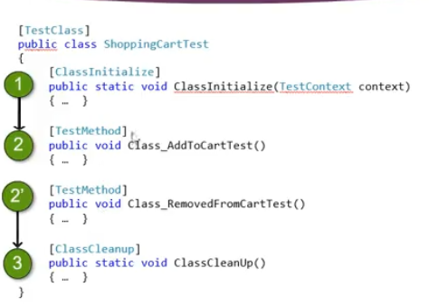

# Unit Test
## Class Level
```csharp
    [TestClass]
    public class CartTest
    {
        [ClassInitialize]
        public static void ClassInitialize(TestContext context)
        {
            //Arrange
        }

        [ClassCleanup]
        public static void ClassCleanup()
        {
          //ClearMeth
        }
        [TestMethod]
        public void AddMethod()
        {
            //Act
            //Assert
        }
```


- [Documentation 1](https://docs.microsoft.com/en-us/visualstudio/test/unit-test-basics?view=vs-2019)
- [Documentation 2](https://docs.microsoft.com/en-us/previous-versions/visualstudio/visual-studio-2013/ms245248(v=vs.120))
